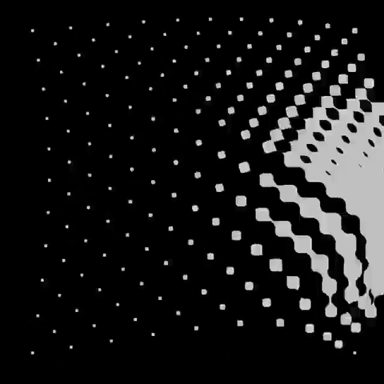

# solemne2-pensamiento-computacional-sec6
documentación de mi proceso para la solemne 2 

## links
- p5.js

- visor pantalla completa

## Un poco de nuestro enfoque para el proyecto


Nuestro enfoqué nació de querer representar esta especie de textura a través de un diseño interactivo. Encontramos que sería interesante llevarlo a cabo para nuestra solemne, aparte que cumple con los requerimientos para hacerlo interactivo:

- Tiene una cuadrícula de elementos que podrían variar de tamaño según el mouse.
- El foco de expansión podría controlarse con el mouse.

## Documentación del proceso 
(Para leer nuestros comentarios vea el link p5.js)
**Primer paso** Definir las variantes globales, esto es para que loscódigos que pongamos en un inicio, se sigan usando permanentemente en el proyecto.
```
 let espacio=36;
 function setup() {
  createCanvas(600, 600);
  
}
```
#
Al poner play, no se verá nada porque solo definimos las reglas que seguirán las proximas funciones
 (insertar foto) 

**Segundo paso** Nos vamos a fuction draw para definir nuestra función propia, pero antes dejamos puestas las columnas y filas que usaremos.
```
function draw() {
  background(240);
  
    for (let x=0 ; x < width;x +=espacio){
    
    for(let y=0 ; y < height;y +=espacio) {

            dibujarPunto(x,y);
      
      
    }
  }
}
```
#
- Al poner play nos dimos cuenta que no podíamos poner el "dibujarPunto(x,y), entonces si queríamos ver en ese momento como iba nuestro lienzo, teníamos que borrarlo.
 8INSERTAR FOTOOOO

  **Tercer paso parte. 1** Ahora ejecutamos nuestra función propia, la función recibe la posición de cada punto de la cuadrícula y mide qué tan lejos está del mouse. 

Con esa distancia definida, decide el tamaño del punto: los cercanos al mouse son grandes y los lejanos son pequeños.

 Le agrega un pequeño temblor aleatorio para que no se vea estático y aburrido. Si el punto está cerca del mouse se pinta negro, si está lejos se pinta gris y se verá más pequeño.

 ```
function dibujarPunto(x,y) {

    let centroX = mouseX;
  let centroY = mouseY; 
  
  let d = dist(x, y, centroX, centroY);

  let tam = map(d, 0, 300, 35, 2);
  
  let variacion=random(-1,1);

  tam=tam+variacion;

  tam = constrain(tam, 2, 35);
 ```
#
INSERTAR FOTOOOOO

 **Tercer paso parte. 2** Por último, definimos una condición basada en la distancia al mouse: si el punto está a menos de 150px se pinta de negro y si está más lejos de 150px se pinta de gris. Finalmente, cada punto se dibuja como un círculo usando el comando ellipse(), tomando su posición en la cuadrícula y el tamaño calculado según la distancia.
```  
   if(d<150){
    
    noStroke();
    fill(0);
    
  } else {
    fill(120);
  }

  ellipse(x, y, tam, tam);
  
}
```

#
FOTOOOO

##  Descripción objetiva

**¿Qué es el proyecto?** Es una composición visual interactiva que genera una cuadrícula de puntos circulares que reaccionan al movimiento del mouse en tiempo real.

**¿Qué se ve en pantalla?** Un lienzo de 600x600px con fondo gris claro sobre el que aparecen puntos distribuidos en filas y columnas. El conjunto crea un efecto de campo de fuerza que es manejado por el cursor.

**¿Qué elementos visuales aparecen?** Círculos puestos en una cuadrícula separados. Varían su tamaño y color según la distancia al mouse, y tienen un pequeño temblor aleatorio que les da sensación de movimiento constante.

**¿Qué inputs utiliza?** El único input es la posición del mouse, que determina en tiempo real el tamaño y el color de cada punto.

**¿Qué outputs genera?** Una animación continua donde los puntos cercanos al cursor se muestran grandes y negros, y los más lejanos pequeños y grises, generando un contraste visual que sigue al usuario mientras mueve el mouse.

## Descripción conceptual

**Idea central del proyecto** Nuestro proyecto explora cómo una cuadrícula simple puede volverse un sistema vivo a través de la interacción. El mouse no es solo un cursor, sino una fuerza que deforma el campo visual, generando la sensación de que los puntos reaccionan a la presencia del usuario.

**Corriente o referente de diseño con el que dialoga** Dialoga con el arte generativo y el diseño interactivo, donde el código es el medium creativo y el usuario forma parte de la obra. Se conecta también con la estética del diseño de sistemas y el arte cinético, donde el movimiento es el elemento principal de la composición.

**Listado y breve descripción de referentes visuales, teóricos o históricos** Al momento de encontrar algún referente nos fuimos por el lado de las texturas digitales, pero buscando algún referente que se acerque a nuestro principal objetivo encontramos a Vera Molnár. Ella es una pionera del arte generativo que trabajó con cuadrículas y repetición de formas simples para explorar el orden y el caos. 

**Principio de diseño explorado** Exploramos el principio del contraste y la jerarquía visual. Podemos ver estos dos conceptos en los puntos cercanos al mouse son grandes y negros, mientras los lejanos son pequeños y grises. Esto genera una diferencia visual clara que cambia según el movimiento del usuario.


## Input / Output y sistema + Diagrama de flujo 

**Reglas que gobiernan el sistema (inputs, procesos, outputs)** Este sistema funciona bajo una lógica simple: recibe la posición del mouse, la procesa calculando distancias y transforma esa información en una respuesta visual sobre cada punto de la cuadrícula.

**Explicación del sistema de interactividad** El sistema es interactivo porque reacciona en tiempo real al movimiento del mouse. Cada vez que el usuario mueve el cursor, la función draw se ejecuta automáticamente de nuevo, recalculando la distancia entre el mouse y cada punto de la cuadrícula. Esa distancia actualizada cambia el tamaño y el color de cada punto al instante, sin que el usuario tenga que hacer clic ni ejecutar ninguna acción adicional. 

El mouse es el único control, y su posición es lo que mantiene el sistema vivo y en movimiento constante.

**Qué datos entran** El único dato que entra es la posición del mouse en el canvas (mouseX, mouseY).

**Cómo se procesan y transforman** Para cada punto de la cuadrícula se calcula su distancia al mouse con el comando dist. Esa distancia se convierte en tamaño usando el comando map, se le agrega una variación aleatoria con comando random y se limita con comando constrain. Luego se evalúa si la distancia es menor a 150px para definir el color.

**Qué respuesta visual producen** Como lo hemos dicho anteriormente, los puntos cercanos al mouse crecen y se vuelven negros, los lejanos se achican y se vuelven grises. El resultado es una animación continua que reacciona en tiempo real al movimiento del usuario.


