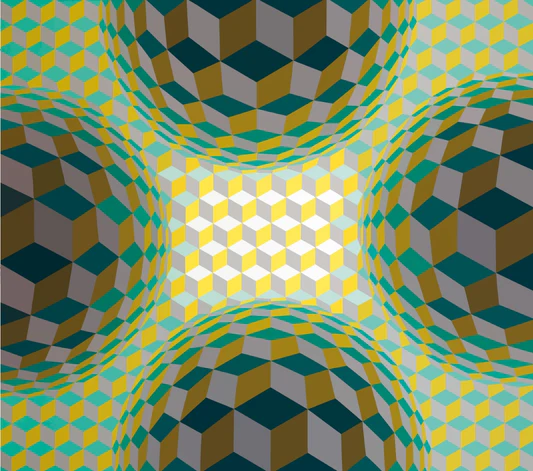

# solemne2-pensamiento-computacional-sec6
documentación de mi proceso para la solemne 2 

- ## link p5js
- ## visor pantalla completa

## Un poco de mi enfoqué para mi trabajo

Las obras de Victor Vasarely, quien es considerado el padre del Op Art, fueron las que me dieron una idea de lo que estaba buscando hacer para esta solemne. 
Considero que Victor Vasarely cumple perfectamente con el objetivo de la entrega, ya que:

- Usa figuras básicas, pero las distorsiona para dar el efecto de ilusión optica.
- Colores vibrantes que llaman la atención.
- Tiene muchas formas de llevarse a cabo en p5.js

## Documentación del proceso

##  Descripción objetiva

## Descripción conceptual

## Input / Output y sistema + Diagrama de flujo 

